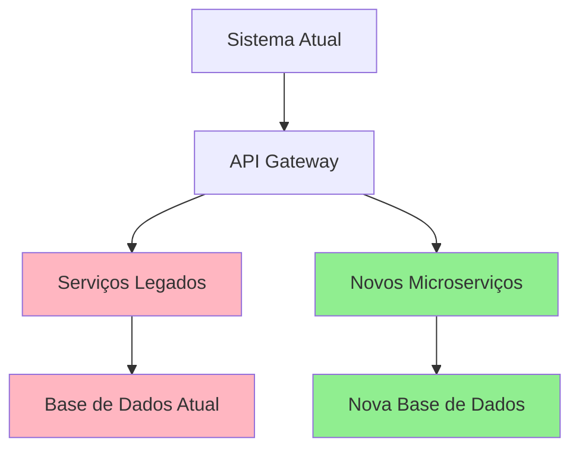

# Plano de Implementação e Migração - BillionMail

## Visão Geral

Este documento apresenta um plano detalhado para a implementação da nova arquitetura segura e escalável do BillionMail, incluindo estratégias de migração, cronograma e gerenciamento de riscos.

## 1. Estratégia de Migração

### 1.1 Abordagem Híbrida (Strangler Fig Pattern)



### 1.2 Fases de Migração

#### Fase 0: Preparação (Semanas 1-2)
- Análise detalhada do código existente
- Configuração do ambiente de desenvolvimento
- Treinamento da equipe
- Definição de métricas de sucesso

#### Fase 1: Infraestrutura Base (Semanas 3-6)
- Setup do cluster Kubernetes
- Implementação do API Gateway
- Configuração de monitoramento básico
- Implementação de CI/CD pipeline

#### Fase 2: Serviços de Autenticação (Semanas 7-10)
- Migração do sistema de autenticação
- Implementação de Zero Trust
- Configuração de RBAC
- Testes de segurança

#### Fase 3: Serviços de Email (Semanas 11-16)
- Migração dos serviços SMTP/IMAP/POP3
- Implementação de criptografia end-to-end
- Configuração de anti-spam/anti-malware
- Testes de performance

#### Fase 4: Serviços de Dados (Semanas 17-20)
- Migração de dados
- Implementação de backup/recovery
- Configuração de replicação
- Testes de integridade

#### Fase 5: Finalização (Semanas 21-24)
- Descomissionamento do sistema legado
- Otimizações finais
- Documentação completa
- Treinamento de operações

## 2. Cronograma Detalhado

### 2.1 Roadmap Executivo

| Fase | Duração | Marcos Principais | Critérios de Sucesso |
|------|---------|-------------------|----------------------|
| 0 | 2 semanas | Análise completa, Ambiente configurado | 100% código analisado, Ambiente funcional |
| 1 | 4 semanas | Cluster K8s, API Gateway, CI/CD | Deploy automatizado, Monitoramento ativo |
| 2 | 4 semanas | Auth Service, Zero Trust | Autenticação funcional, Políticas ativas |
| 3 | 6 semanas | Email Services | SMTP/IMAP/POP3 funcionais, Criptografia |
| 4 | 4 semanas | Data Migration | Dados migrados, Backup funcional |
| 5 | 4 semanas | Go-Live | Sistema legado desativado |

### 2.2 Cronograma Detalhado por Semana

```gantt
title Cronograma de Implementação BillionMail
dateFormat  YYYY-MM-DD
section Preparação
Análise de Código           :prep1, 2024-01-01, 1w
Setup Ambiente             :prep2, after prep1, 1w
section Infraestrutura
Cluster Kubernetes         :infra1, after prep2, 2w
API Gateway               :infra2, after infra1, 1w
CI/CD Pipeline            :infra3, after infra2, 1w
section Autenticação
Auth Service              :auth1, after infra3, 2w
Zero Trust                :auth2, after auth1, 2w
section Email Services
SMTP Service              :email1, after auth2, 2w
IMAP/POP3 Services        :email2, after email1, 2w
Criptografia              :email3, after email2, 2w
section Dados
Migração de Dados         :data1, after email3, 3w
Backup/Recovery           :data2, after data1, 1w
section Finalização
Testes Finais             :final1, after data2, 2w
Go-Live                   :final2, after final1, 2w
```

## 3. Plano de Implementação Técnica

### 3.1 Fase 0: Preparação

#### Semana 1: Análise de Código
```bash
# Scripts de análise
#!/bin/bash
# analyze-codebase.sh

echo "Iniciando análise do código BillionMail..."

# Análise de dependências
go mod graph > dependencies.txt

# Análise de complexidade
find . -name "*.go" -exec gocyclo -over 15 {} \;

# Análise de segurança
gosec ./...

# Análise de qualidade
golangci-lint run

# Métricas de código
cloc --by-file --xml --out=metrics.xml .

echo "Análise concluída. Verifique os relatórios gerados."
```

#### Semana 2: Setup do Ambiente
```yaml
# docker-compose.dev.yml
version: '3.8'
services:
  postgres:
    image: postgres:15-alpine
    environment:
      POSTGRES_DB: billionmail_dev
      POSTGRES_USER: dev
      POSTGRES_PASSWORD: dev123
    ports:
      - "5432:5432"
    volumes:
      - postgres_data:/var/lib/postgresql/data

  redis:
    image: redis:7-alpine
    ports:
      - "6379:6379"
    volumes:
      - redis_data:/data

  mailhog:
    image: mailhog/mailhog
    ports:
      - "1025:1025"
      - "8025:8025"

volumes:
  postgres_data:
  redis_data:
```

### 3.2 Fase 1: Infraestrutura Base

#### Cluster Kubernetes
```yaml
# cluster-config.yaml
apiVersion: v1
kind: ConfigMap
metadata:
  name: cluster-config
data:
  cluster.yaml: |
    apiVersion: kind.x-k8s.io/v1alpha4
    kind: Cluster
    nodes:
    - role: control-plane
      kubeadmConfigPatches:
      - |
        kind: InitConfiguration
        nodeRegistration:
          kubeletExtraArgs:
            node-labels: "ingress-ready=true"
      extraPortMappings:
      - containerPort: 80
        hostPort: 80
        protocol: TCP
      - containerPort: 443
        hostPort: 443
        protocol: TCP
    - role: worker
    - role: worker
    - role: worker
```

#### API Gateway (Kong)
```yaml
# kong-gateway.yaml
apiVersion: apps/v1
kind: Deployment
metadata:
  name: kong-gateway
spec:
  replicas: 3
  selector:
    matchLabels:
      app: kong-gateway
  template:
    metadata:
      labels:
        app: kong-gateway
    spec:
      containers:
      - name: kong
        image: kong:3.4
        env:
        - name: KONG_DATABASE
          value: "off"
        - name: KONG_DECLARATIVE_CONFIG
          value: "/kong/declarative/kong.yml"
        - name: KONG_PROXY_ACCESS_LOG
          value: "/dev/stdout"
        - name: KONG_ADMIN_ACCESS_LOG
          value: "/dev/stdout"
        - name: KONG_PROXY_ERROR_LOG
          value: "/dev/stderr"
        - name: KONG_ADMIN_ERROR_LOG
          value: "/dev/stderr"
        - name: KONG_ADMIN_LISTEN
          value: "0.0.0.0:8001"
        ports:
        - containerPort: 8000
        - containerPort: 8443
        - containerPort: 8001
        - containerPort: 8444
        volumeMounts:
        - name: kong-config
          mountPath: /kong/declarative/
      volumes:
      - name: kong-config
        configMap:
          name: kong-config
```

### 3.3 Fase 2: Serviços de Autenticação

#### Auth Service Implementation
```go
// internal/services/auth/service.go
package auth

import (
    "context"
    "crypto/rand"
    "encoding/base64"
    "time"
    
    "github.com/golang-jwt/jwt/v5"
    "golang.org/x/crypto/bcrypt"
)

type AuthService struct {
    jwtSecret     []byte
    tokenExpiry   time.Duration
    refreshExpiry time.Duration
    userRepo      UserRepository
    sessionRepo   SessionRepository
}

type Claims struct {
    UserID   string   `json:"user_id"`
    Username string   `json:"username"`
    Roles    []string `json:"roles"`
    jwt.RegisteredClaims
}

func NewAuthService(secret []byte, userRepo UserRepository, sessionRepo SessionRepository) *AuthService {
    return &AuthService{
        jwtSecret:     secret,
        tokenExpiry:   15 * time.Minute,
        refreshExpiry: 7 * 24 * time.Hour,
        userRepo:      userRepo,
        sessionRepo:   sessionRepo,
    }
}

func (s *AuthService) Authenticate(ctx context.Context, username, password string) (*TokenPair, error) {
    user, err := s.userRepo.GetByUsername(ctx, username)
    if err != nil {
        return nil, ErrInvalidCredentials
    }
    
    if err := bcrypt.CompareHashAndPassword([]byte(user.PasswordHash), []byte(password)); err != nil {
        return nil, ErrInvalidCredentials
    }
    
    return s.generateTokenPair(user)
}

func (s *AuthService) generateTokenPair(user *User) (*TokenPair, error) {
    // Generate access token
    accessClaims := &Claims{
        UserID:   user.ID,
        Username: user.Username,
        Roles:    user.Roles,
        RegisteredClaims: jwt.RegisteredClaims{
            ExpiresAt: jwt.NewNumericDate(time.Now().Add(s.tokenExpiry)),
            IssuedAt:  jwt.NewNumericDate(time.Now()),
            NotBefore: jwt.NewNumericDate(time.Now()),
            Issuer:    "billionmail-auth",
            Subject:   user.ID,
        },
    }
    
    accessToken := jwt.NewWithClaims(jwt.SigningMethodHS256, accessClaims)
    accessTokenString, err := accessToken.SignedString(s.jwtSecret)
    if err != nil {
        return nil, err
    }
    
    // Generate refresh token
    refreshToken, err := s.generateRefreshToken()
    if err != nil {
        return nil, err
    }
    
    // Store refresh token
    session := &Session{
        UserID:       user.ID,
        RefreshToken: refreshToken,
        ExpiresAt:    time.Now().Add(s.refreshExpiry),
        CreatedAt:    time.Now(),
    }
    
    if err := s.sessionRepo.Create(context.Background(), session); err != nil {
        return nil, err
    }
    
    return &TokenPair{
        AccessToken:  accessTokenString,
        RefreshToken: refreshToken,
        ExpiresIn:    int64(s.tokenExpiry.Seconds()),
    }, nil
}

func (s *AuthService) generateRefreshToken() (string, error) {
    bytes := make([]byte, 32)
    if _, err := rand.Read(bytes); err != nil {
        return "", err
    }
    return base64.URLEncoding.EncodeToString(bytes), nil
}
```

### 3.4 Fase 3: Serviços de Email

#### SMTP Service
```go
// internal/services/smtp/server.go
package smtp

import (
    "crypto/tls"
    "net"
    "time"
    
    "github.com/emersion/go-smtp"
)

type Server struct {
    addr        string
    tlsConfig   *tls.Config
    authHandler AuthHandler
    backend     Backend
}

func NewServer(addr string, tlsConfig *tls.Config, authHandler AuthHandler, backend Backend) *Server {
    return &Server{
        addr:        addr,
        tlsConfig:   tlsConfig,
        authHandler: authHandler,
        backend:     backend,
    }
}

func (s *Server) Start() error {
    server := smtp.NewServer(s.backend)
    
    server.Addr = s.addr
    server.Domain = "billionmail.com"
    server.WriteTimeout = 10 * time.Second
    server.ReadTimeout = 10 * time.Second
    server.MaxMessageBytes = 25 * 1024 * 1024 // 25MB
    server.MaxRecipients = 50
    server.AllowInsecureAuth = false
    server.EnableSMTPUTF8 = true
    
    if s.tlsConfig != nil {
        server.TLSConfig = s.tlsConfig
    }
    
    server.AuthDisabled = false
    
    listener, err := net.Listen("tcp", s.addr)
    if err != nil {
        return err
    }
    
    return server.Serve(listener)
}
```

## 4. Estratégia de Testes

### 4.1 Testes Automatizados

```yaml
# .github/workflows/test.yml
name: Comprehensive Testing
on:
  push:
    branches: [main, develop]
  pull_request:
    branches: [main]

jobs:
  unit-tests:
    runs-on: ubuntu-latest
    steps:
    - uses: actions/checkout@v3
    - uses: actions/setup-go@v4
      with:
        go-version: '1.21'
    
    - name: Run unit tests
      run: |
        go test -v -race -coverprofile=coverage.out ./...
        go tool cover -html=coverage.out -o coverage.html
    
    - name: Upload coverage
      uses: codecov/codecov-action@v3
      with:
        file: ./coverage.out

  integration-tests:
    runs-on: ubuntu-latest
    services:
      postgres:
        image: postgres:15
        env:
          POSTGRES_PASSWORD: test
        options: >-
          --health-cmd pg_isready
          --health-interval 10s
          --health-timeout 5s
          --health-retries 5
      redis:
        image: redis:7
        options: >-
          --health-cmd "redis-cli ping"
          --health-interval 10s
          --health-timeout 5s
          --health-retries 5
    
    steps:
    - uses: actions/checkout@v3
    - uses: actions/setup-go@v4
      with:
        go-version: '1.21'
    
    - name: Run integration tests
      run: |
        go test -v -tags=integration ./tests/integration/...

  security-tests:
    runs-on: ubuntu-latest
    steps:
    - uses: actions/checkout@v3
    - uses: actions/setup-go@v4
      with:
        go-version: '1.21'
    
    - name: Run security scan
      run: |
        go install github.com/securecodewarrior/gosec/v2/cmd/gosec@latest
        gosec -fmt sarif -out gosec-report.sarif ./...
    
    - name: Upload SARIF file
      uses: github/codeql-action/upload-sarif@v2
      with:
        sarif_file: gosec-report.sarif

  performance-tests:
    runs-on: ubuntu-latest
    steps:
    - uses: actions/checkout@v3
    
    - name: Run load tests
      run: |
        docker run --rm -i grafana/k6 run - <tests/performance/load-test.js
```

### 4.2 Testes de Performance

```javascript
// tests/performance/load-test.js
import http from 'k6/http';
import { check, sleep } from 'k6';
import { Rate } from 'k6/metrics';

export let errorRate = new Rate('errors');

export let options = {
  stages: [
    { duration: '2m', target: 100 }, // Ramp up
    { duration: '5m', target: 100 }, // Stay at 100 users
    { duration: '2m', target: 200 }, // Ramp up to 200 users
    { duration: '5m', target: 200 }, // Stay at 200 users
    { duration: '2m', target: 0 },   // Ramp down
  ],
  thresholds: {
    http_req_duration: ['p(95)<500'], // 95% of requests must complete below 500ms
    errors: ['rate<0.1'], // Error rate must be below 10%
  },
};

export default function() {
  // Test authentication
  let authResponse = http.post('http://api.billionmail.local/auth/login', {
    username: 'testuser',
    password: 'testpass',
  });
  
  let authCheck = check(authResponse, {
    'auth status is 200': (r) => r.status === 200,
    'auth response time < 200ms': (r) => r.timings.duration < 200,
  });
  
  errorRate.add(!authCheck);
  
  if (authCheck) {
    let token = JSON.parse(authResponse.body).access_token;
    
    // Test email sending
    let emailResponse = http.post('http://api.billionmail.local/mail/send', {
      to: 'test@example.com',
      subject: 'Load test email',
      body: 'This is a test email from k6 load test',
    }, {
      headers: {
        'Authorization': `Bearer ${token}`,
        'Content-Type': 'application/json',
      },
    });
    
    let emailCheck = check(emailResponse, {
      'email status is 200': (r) => r.status === 200,
      'email response time < 1000ms': (r) => r.timings.duration < 1000,
    });
    
    errorRate.add(!emailCheck);
  }
  
  sleep(1);
}
```

## 5. Gerenciamento de Riscos

### 5.1 Matriz de Riscos

| Risco | Probabilidade | Impacto | Mitigação |
|-------|---------------|---------|----------|
| Perda de dados durante migração | Baixa | Alto | Backups múltiplos, testes de restore |
| Downtime prolongado | Média | Alto | Blue-green deployment, rollback plan |
| Problemas de performance | Média | Médio | Load testing, monitoring proativo |
| Vulnerabilidades de segurança | Baixa | Alto | Security scanning, penetration testing |
| Resistência da equipe | Média | Médio | Treinamento, comunicação clara |

### 5.2 Plano de Contingência

```yaml
# rollback-plan.yaml
apiVersion: v1
kind: ConfigMap
metadata:
  name: rollback-procedures
data:
  rollback.sh: |
    #!/bin/bash
    set -e
    
    echo "Iniciando procedimento de rollback..."
    
    # 1. Parar novos deployments
    kubectl patch argocd-app billionmail-prod -p '{"spec":{"syncPolicy":{"automated":null}}}'
    
    # 2. Restaurar versão anterior
    kubectl rollout undo deployment/billionmail-api
    kubectl rollout undo deployment/billionmail-core
    
    # 3. Verificar status
    kubectl rollout status deployment/billionmail-api
    kubectl rollout status deployment/billionmail-core
    
    # 4. Restaurar dados se necessário
    if [ "$RESTORE_DATA" = "true" ]; then
      velero restore create --from-backup billionmail-backup-$(date -d "1 day ago" +%Y%m%d)
    fi
    
    # 5. Verificar saúde do sistema
    kubectl get pods -l app=billionmail
    
    echo "Rollback concluído com sucesso!"
```

## 6. Monitoramento e Alertas

### 6.1 SLIs e SLOs

```yaml
# slo-config.yaml
apiVersion: v1
kind: ConfigMap
metadata:
  name: slo-config
data:
  slos.yaml: |
    slos:
      - name: api-availability
        description: "API deve estar disponível 99.9% do tempo"
        target: 0.999
        window: 30d
        
      - name: email-delivery-latency
        description: "95% dos emails devem ser entregues em menos de 30s"
        target: 0.95
        threshold: 30s
        window: 24h
        
      - name: authentication-success-rate
        description: "Taxa de sucesso de autenticação deve ser > 99%"
        target: 0.99
        window: 24h
```

### 6.2 Alertas Críticos

```yaml
# alerts.yaml
apiVersion: monitoring.coreos.com/v1
kind: PrometheusRule
metadata:
  name: billionmail-alerts
spec:
  groups:
  - name: billionmail.critical
    rules:
    - alert: ServiceDown
      expr: up{job="billionmail"} == 0
      for: 1m
      labels:
        severity: critical
      annotations:
        summary: "BillionMail service is down"
        description: "Service {{ $labels.instance }} has been down for more than 1 minute"
        
    - alert: HighErrorRate
      expr: rate(http_requests_total{status=~"5.."}[5m]) > 0.1
      for: 5m
      labels:
        severity: warning
      annotations:
        summary: "High error rate detected"
        description: "Error rate is {{ $value }} errors per second"
        
    - alert: DatabaseConnectionFailure
      expr: postgresql_up == 0
      for: 30s
      labels:
        severity: critical
      annotations:
        summary: "Database connection failure"
        description: "Cannot connect to PostgreSQL database"
```

## 7. Treinamento e Documentação

### 7.1 Plano de Treinamento

#### Semana 1-2: Fundamentos
- Kubernetes básico
- Docker e containerização
- Conceitos de microserviços

#### Semana 3-4: Ferramentas
- Istio service mesh
- Prometheus e Grafana
- ArgoCD e GitOps

#### Semana 5-6: Operações
- Troubleshooting
- Incident response
- Backup e recovery

### 7.2 Documentação Operacional

```markdown
# Runbook - BillionMail Operations

## Procedimentos de Emergência

### 1. Service Down
1. Verificar status dos pods: `kubectl get pods -n billionmail-prod`
2. Verificar logs: `kubectl logs -f deployment/billionmail-api`
3. Verificar recursos: `kubectl top pods -n billionmail-prod`
4. Se necessário, reiniciar: `kubectl rollout restart deployment/billionmail-api`

### 2. Database Issues
1. Verificar conexões: `kubectl exec -it postgres-0 -- psql -c "SELECT count(*) FROM pg_stat_activity;"`
2. Verificar espaço: `kubectl exec -it postgres-0 -- df -h`
3. Verificar logs: `kubectl logs postgres-0`

### 3. Performance Issues
1. Verificar métricas no Grafana
2. Analisar traces no Jaeger
3. Verificar auto-scaling: `kubectl get hpa`
4. Escalar manualmente se necessário: `kubectl scale deployment billionmail-api --replicas=10`
```

## 8. Critérios de Sucesso

### 8.1 Métricas Técnicas
- **Disponibilidade**: 99.9% uptime
- **Performance**: P95 < 500ms para APIs
- **Throughput**: 10,000 emails/minuto
- **Recovery Time**: RTO < 15 minutos
- **Recovery Point**: RPO < 5 minutos

### 8.2 Métricas de Negócio
- **Redução de custos**: 30% economia em infraestrutura
- **Time to Market**: 50% redução no tempo de deploy
- **Satisfação do usuário**: > 95% satisfaction score
- **Compliance**: 100% conformidade com regulamentações

## 9. Pós-Implementação

### 9.1 Otimização Contínua
- Revisão mensal de performance
- Otimização de custos trimestralmente
- Atualizações de segurança semanais
- Disaster recovery testing mensal

### 9.2 Roadmap Futuro
- **Q2 2024**: Implementação de AI/ML para anti-spam
- **Q3 2024**: Multi-region deployment
- **Q4 2024**: Advanced analytics e reporting
- **Q1 2025**: Mobile app nativo

## Conclusão

Este plano de implementação e migração fornece um roadmap detalhado para a transformação do BillionMail em uma plataforma moderna, segura e escalável. O sucesso depende da execução cuidadosa de cada fase, monitoramento contínuo e adaptação às necessidades emergentes.

### Próximos Passos
1. Aprovação do plano pela liderança
2. Alocação de recursos e equipe
3. Início da Fase 0 - Preparação
4. Setup do ambiente de desenvolvimento
5. Kickoff do projeto com toda a equipe